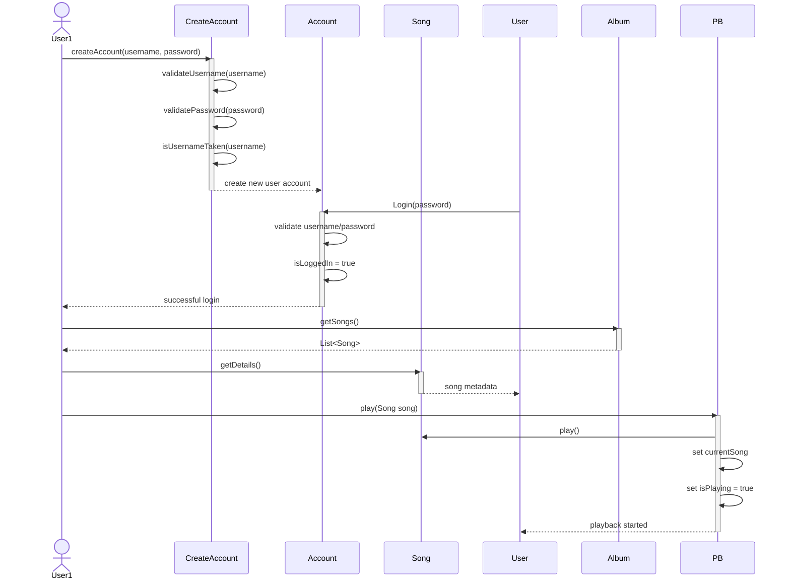

```mermaid
sequenceDiagram
    % actors
    actor User1

    % participants (objects)
    participant CA as CreateAccount
    participant ACC as Account
    participant Song as Song

    % CreateAccount Flow
    User1->>CA: createAccount(username, password)
    activate CA
    CA->>CA: validateUsername(username)
    CA->>CA: validatePassword(password)
    CA->>CA: isUsernameTaken(username)
    CA-->>ACC: create new user account
    deactivate CA

    % Login flow
    User->>ACC: Login(password)
    activate ACC
    ACC->>ACC: validate username/password
    ACC->>ACC: isLoggedIn = true
    ACC-->>User1: successful login
    deactivate ACC

    %% Song Playback Flow
    User1->>Album: getSongs()
    activate Album
    Album-->>User1: List<Song>
    deactivate Album
    
    User1->>Song: getDetails()
    activate Song
    Song-->>User: song metadata
    deactivate Song
    
    User1->>PB: play(Song song)
    activate PB
    PB->>Song: play()
    PB->>PB: set currentSong
    PB->>PB: set isPlaying = true
    PB-->>User: playback started
    deactivate PB

```
