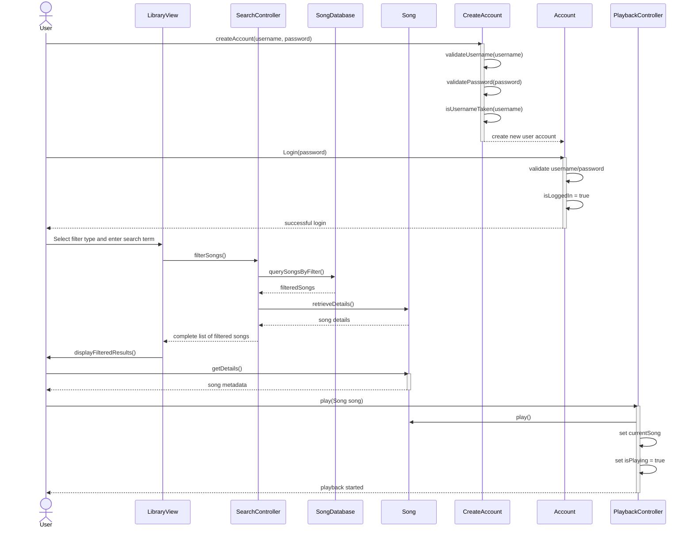

```mermaid
sequenceDiagram
    actor User
    participant LibraryView
    participant SearchController
    participant SongDatabase
    participant Song
    participant CA as CreateAccount
    participant ACC as Account
    participant PB as PlaybackController

    %% Account Creation Flow
    User->>CA: createAccount(username, password)
    activate CA
    CA->>CA: validateUsername(username)
    CA->>CA: validatePassword(password)
    CA->>CA: isUsernameTaken(username)
    CA-->>ACC: create new user account
    deactivate CA

    %% Login Flow
    User->>ACC: Login(password)
    activate ACC
    ACC->>ACC: validate username/password
    ACC->>ACC: isLoggedIn = true
    ACC-->>User: successful login
    deactivate ACC

    %% Search Flow
    User->>LibraryView: Select filter type and enter search term
    LibraryView->>SearchController: filterSongs()
    SearchController->>SongDatabase: querySongsByFilter()
    SongDatabase-->>SearchController: filteredSongs
    SearchController->>Song: retrieveDetails()
    Song-->>SearchController: song details
    SearchController-->>LibraryView: complete list of filtered songs
    LibraryView->>User: displayFilteredResults()

    %% Playback Flow
    User->>Song: getDetails()
    activate Song
    Song-->>User: song metadata
    deactivate Song
    User->>PB: play(Song song)
    activate PB
    PB->>Song: play()
    PB->>PB: set currentSong
    PB->>PB: set isPlaying = true
    PB-->>User: playback started
    deactivate PB
```